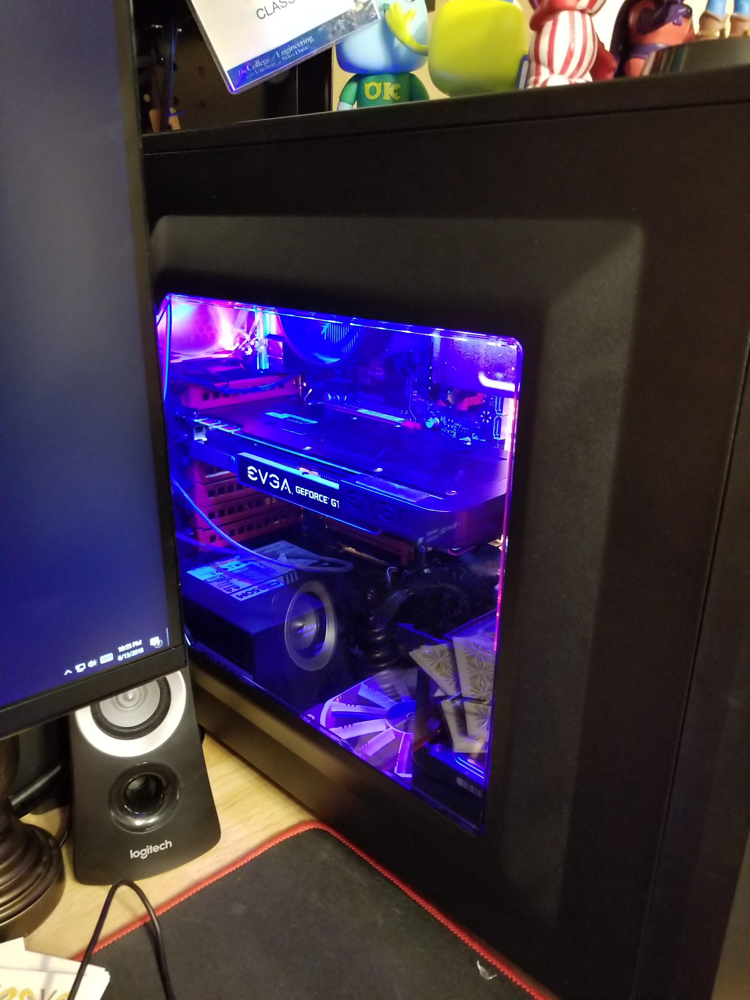

+++
date = "2018-06-15T02:03:30-04:00"
draft = false
title = "My new favorite thing"
tags = [ "Ads" ]
categories = [ "Ads" ]
series = [ "Goofing off" ]
+++

Back when I did [my arcade machine](https://johnwesthoff.com/projects/arcademachine/), I encountered two pretty big problems.
First of all, writing the code to mimick a USB keyboard was not straightforward at all, and I resorted to copying some sample
code and modifying it. But I didn't understand the sample code at all. I know the TI boards are probably aimed at a more hardcode
audience, one that wants to have as much control over the hardware as possibl, and while I usually love that sort of thing, there are
days where I want to just write simple code. Looking back at the code now, I realize the sample code is better commented than I thought
it was at the time, but to a much more novice me I could hardly follow it. I also realized that I have some mistakes in my comments, that
I don't even understand all of my code, that I didn't even bother changing what it did, and that there is a big copyright notice.

I'll get to that big copyright notice later, but for now I'll discuss my other big problem - I did not make it easy at all to change
what the controls map to. If you wanted the player one UP control to map to, say, `Y` for some reason, you would need to plug a micro USB
cable into the programming USB port on the board, open up Code Composer Studio, download my project code, edit the code, and then flash
the board. That's a lot of work for me to change something I designed, but could you imagine if it was a commercial project? You buy this
little USB arcade board, and don't like how it maps, and you're told that's how you have to customize it? Realistically, we don't
even get that with our products. But even if we did, and even if the code was all free software, it would be very hard for end users to
excercise their freedom to modify the device.

While browsing the [adafruit](https://www.adafruit.com/) website, I stumbled upon some totally awesome boards that solve both of those
problems. The first being [this MicroPython board](https://www.adafruit.com/product/2390), which was a little expensive for my tastes.
But later, I saw some cheaper boards - even one that was only $9!
They run [CircuitPython](https://learn.adafruit.com/welcome-to-circuitpython?view=all), "a programming language designed to simplify experimenting and learning to program on low-cost microcontroller boards" that also happens to solve my two big problems above.

They solve my first problem in several ways. First of all, they swap out Python for C. While I love C, it is definitely the case that
when I am just trying to do something quickly the easy way, I use Python. But on top of that, the [board I used](https://www.adafruit.com/product/3500)
came with sample code showing off the kitchen sink, making it really easy to get started doing whatever you need to. On top of that, there
isn't anything to install, no IDEs, no compilers, no anything at all. You just edit the `main.py` file, and it works, it just works.
Additionally, adafruit always has thorough guids that really help with a lot of DIY projects.
To top it all off, installing libraries is dead simple - you just drag them to the lib folder. While that isn't that unusual, it makes it
very easy to have all of the dependencies on the board itself, self contained for that one project. Which leads me to how it solves the
second problem...

If a product used CircuitPython, user configurability would be the default. How? Well, when you plug in a board running CircuitPython into
a computer's USB port, it appears as a drive containing the python code it is running as well as all of its libraries. This is the single
greatest feature I have every seen. Could you imagine if your keyboard worked that way? Don't ever use `CAPS LOCK` and want it to be `CTRL`
permanently, on every computer you use it on? Just edit its `code.py`! Similarly, for my arcade machine, it could just load the config
from a file, or just have nice constants at the top of `main.py`. I am strongly tempted to revisit my arcade machine, and perhaps try to
implement something similar, where the configuration is stored on board. Or maybe I'll just swap the board out for one running MicroPython.

Anyways, I stopped at Micro Center and bought the Trinket M0, and after a few minutes of work mostly spent soldering these
[cheap RGB LEDs I had lying around](https://www.amazon.com/gp/product/B00XL44GZW/ref=oh_aui_search_detailpage?ie=UTF8&psc=1), I had
18" of case LEDs in my computer, that are really easy to change however I want - and I can even have them respond to, say, serial events
and then have a program running on my PC control them. I have another spare one that I'm sure I'll come up with lots of ideas for,
though it may end up also controlling some RGB LEDs.

