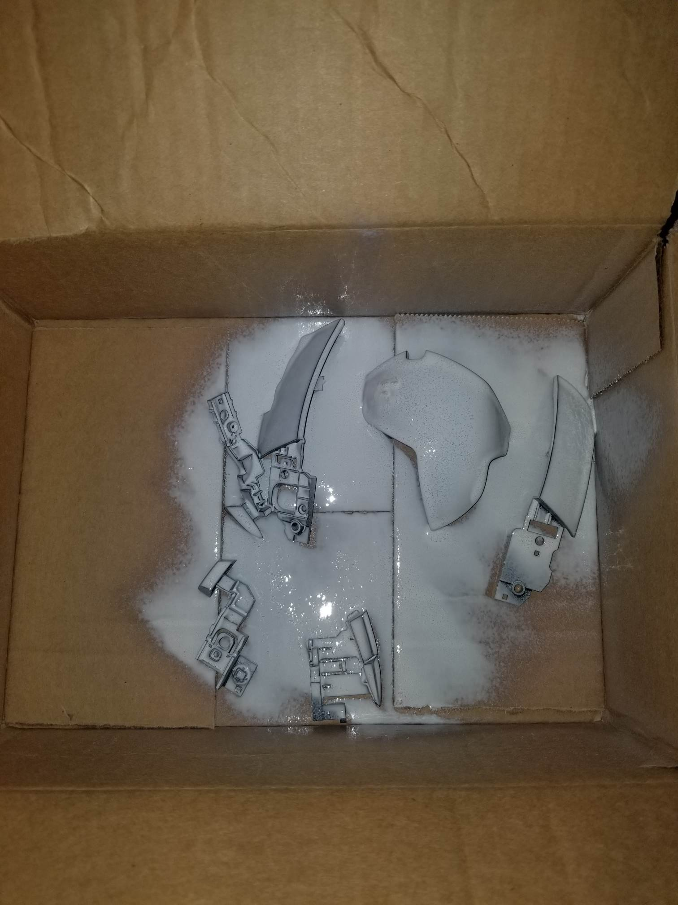
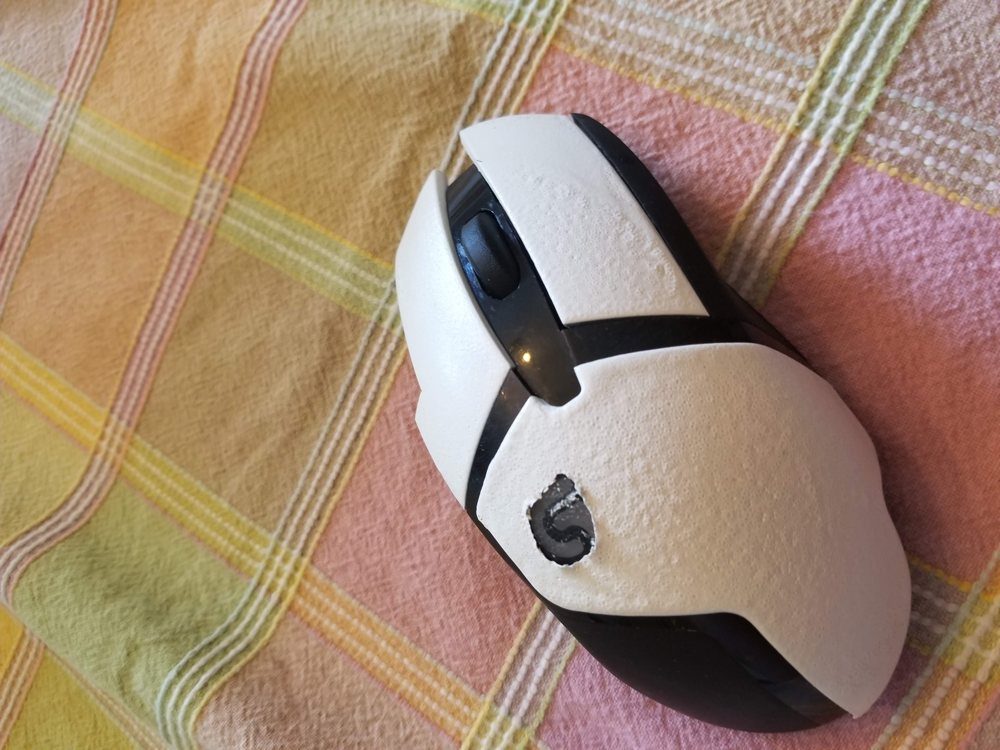
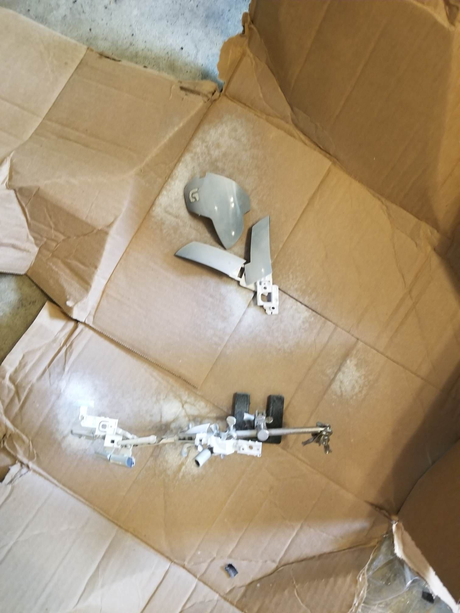
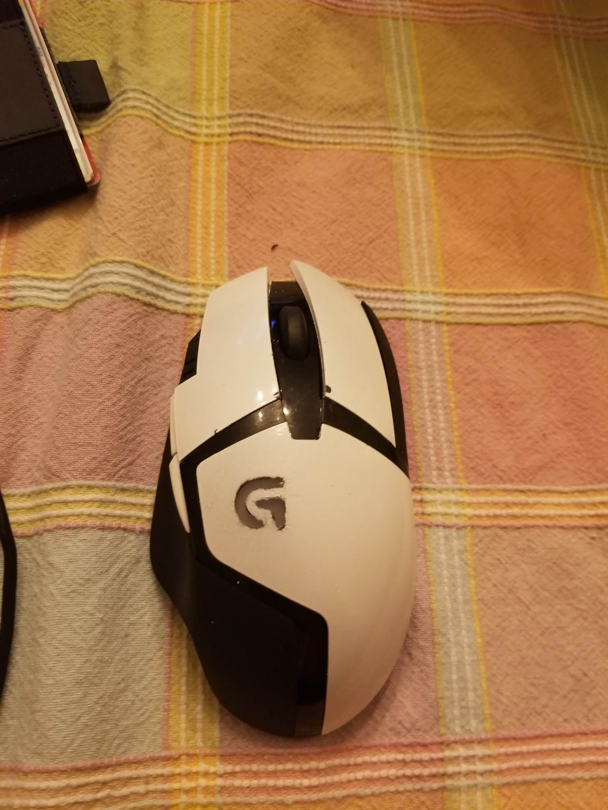
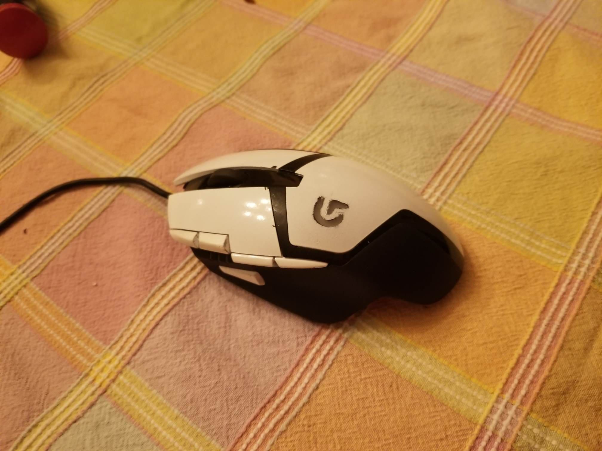

+++
date = "2019-06-08T01:52:30-04:00"
draft = false
title = "Why would anyone spray paint a mouse?"
heading = "Blog"
tags = [ "Ads" ]
categories = [ "Ads" ]
series = [ "Goofing off" ]
+++

This story is going to seem like it is going nowhere, but trust me, it only kind of goes nowhere.

Last year, someone asked me for advice on a pair of headphones for under $50, so I started watching
random collections of tech stuff under $50. This led me to 
[randomfrankp](https://www.youtube.com/user/randomfrankp). After finding out that he was an Eagles
fan, I decided to keep watching his videos, and eventually I saw 
[the single best looking computer mouse of all time](https://www.youtube.com/watch?v=4iGlcelQFNc).

I did want one, but they aren't exactly obtainable, and I was still content with my G402. Since
then, however, two things have changed.  
1. I switched to a G502 as my primary mouse.  
2. A friend started looking for a pink gaming mouse to match her cotton candy color scheme for
the PC build she is planning.  

(1) meant that I had a G402 lying around, and because (2) is a difficult problem 
(yes [this](https://www.razer.com/campaigns/quartz) is a thing... but Razer...) I figured I would
try spray painting the mouse. I figured I could report my findings to my friend, and have a cool
looking G402. What follows is a summary of my experience so far.

## Getting Started  

Tired of constantly losing individual screw drivers and breaking multibit sets, I decided to
order a nice kit that I would force myself to keep in working order. I settled on
the [iFixit Pro Tech Toolkit](https://www.ifixit.com/Store/Tools/Pro-Tech-Toolkit/IF145-307),
and ordered it. I was eager to try it out, so I used it to tear down my G402, removing every screw
and carefully storing them in plastic containers. I then had each individual part of the mouse.

## Plasti Dip  

My first thought for painting the mouse was to use Plasti Dip. I decided on what parts to spray
and ordered a can off Amazon. When it arrived, I cleaned each part of the mouse thoroughly, and
got to work. Before spraying anything, I used masking tape to cover the light up G logo on the
mouse.

I tried to follow the directions pretty well. After a single coat, the mouse parts looked like this.

I thought things were going well! I did make the mistake of putting a layer on indoors
(at least a window was open), but right
after the first coat I moved the box containing everything to my back porch. I also made a bit
of a mistake with simply placing each part on the cardboard box - they became stuck to the box
and some Plasti Dip peeled when I moved the parts.

I added another
coat before going to bed, the next morning I added a coat, and then took a shower. I came back
to the box upside down in the grass, having been blown over by the wind.

The mouse was full of little pits that weren't there before. The internet advised adding a heavy
layer, which I decided to try. It didn't seem to help much, and I was left with this:

This was fine except for the awful texture. So my first lesson was to make sure no external forces,
such as weather, interfere with my paint job.

I quickly learned another lesson, this one more specific to Plasti Dip.
It didn't seem feasible to just remove the masking tape by hand, so I tried to use an exacto knife
to cut it out. It took some Plasti Dip with it, leaving me with this harsh lesson:

So, in the future, I will avoid Plasti Dip on things that can't be entirely coated. I wanted to
preserve the G logo, and between the really messy logo and the pitting, I figured I should try
a different method.

## Krylon Fusion    

I heard some people recommend this Krylon Fusion spray paint - apparently it bonds well with
plastic. So I peeled off my shameful Plasti Dip job, and used some rubbing alcohol to get it all
off as well as clean the parts again. I went out and grabbed a can of glossy white Krylon Fusion,
and once again went to work. I went with much thinner coats this time around, as well as a helping
hand to hold the smaller parts. After a single coat I snapped this picture:

I continued for about 7 coats, and finally became satisified with how it looked. After letting it
dry, I made yet another mistake - I did not put any protective layer over the paint. So, when
reassembling the mouse, some of the paint scraped off. Further, I did a meh job of masking over the
G logo, and, well, the results are just OK:

I'm quite happy with how it looks, despite the obvious blemishes. 
I also learned quite a few lessons, which I will summarize below:  

- Precision is required when masking off a logo and expecting good results. Consider using a
machine cut vinyl sticker if you have the resources, or avoid a mouse with pieces that must be
masked / just paint over the dang logo.  
- Plasti Dip can be used situationally, but should be avoided on parts in which the entire piece
cannot be coated - it loves to peel.   
- A protective layer should be added to the parts before reassembly.  
- Use something to hold parts while painting them so they do not become stuck.  

 
I do think that it is far from a terrible idea to spray paint a mouse. It can give you a pretty
good look (heck, my G402 looked more worn down before painting it, even my meh job was an
improvement, and if I had just painted over the LED logo it would have looked more than decent),
shouldn't impact performance (and depending on the finish can improve grip), and even
serves as a fun side project that doesn't cost a whole lot (assuming you already have a mouse).
All in all, I'd do it again, maybe even on my daily driver G502.
