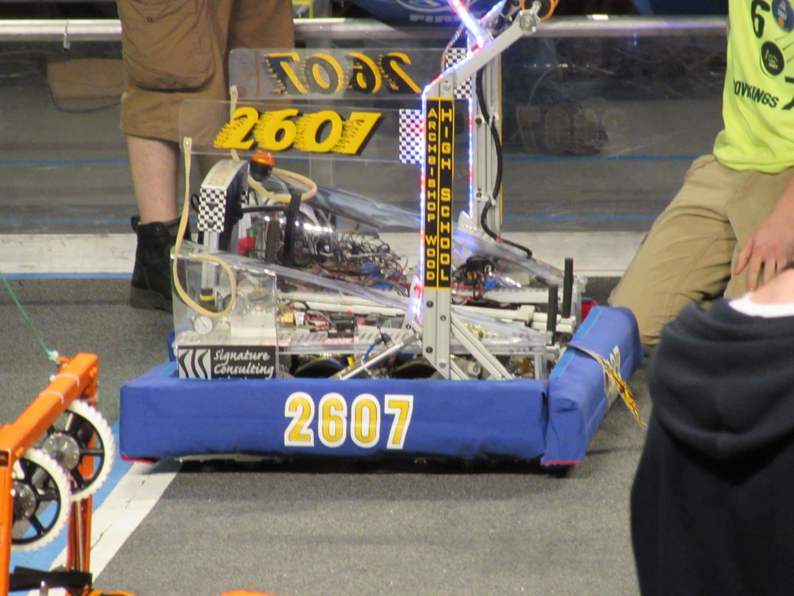

+++
date = "2018-02-18T17:36:00-04:00"
draft = false
visible = false
title = "Reading 05: Why we should not lose points for segfaults"
tags = [ "Ethics" ]
categories = [ "Ethics" ]
series = [ "Ethics" ]
+++

The Therac-25 accidents were caused by reliance on software for safety-critical function, and that software not being absolutely perfect. Software designers have to be incredibly careful to ensure that every state the system
can be in is a safe one, or at least, if it is ever in an unsafe state, alert any operator very clearly. The Therac-25 incidents were caused by this not being followed - if a user switched modes too quickly, the machine
would be left in an unsafe state. It displayed a "Malfunction 54" message, but didn't tell you what that meant, or that it could, you know, kill someone. It is pretty hard to completely verify that software will
work for every possible sequence of events, especially when one such sequence of events is time-dependent, such as the third accident with the machine, where an 8-bit counter overflowing the moment a command was entered caused
it to start in an unsafe state. But it is probably important to ensure that safety-critical software is guarenteed to function correctly. Otherwise, it's probably not a bad idea to put hardware restrictions in place, such
that no matter what the software does, it physically cannot enter an unsafe state. Earlier versions of the Therac were like this.

I think when you design something safety-critical, you need to document everything, and everything needs to be thoroughly understood by at least a team of people. Every possible sequence of what could happen should be
considered, and everything there should be documented, too. All the higher ups need to understand everything, too. Basically, anyone at all responsible for the development of each part of the product should know everything
about what they did, and responsibilities pile up the higher in the ladder you are. If you are the engineer who wrote some bad code, you're at fault. But so is your manager, for not ensuring the code was checked enough,
and so is his manager, for not highering the best people, and so on, to the guy who decided the product was ready to be shipped without absolutely guarenteeing that the system was safe. In a way, the whole company, or at least
the branch that shipped a dangerous product, should be held liable. Engineers who work on these things must be made aware of the consequences of their actions when they are hired, and CEOs and what not have to acknowledge that
they ultimately lead the company, and they are ultimately the most responsible for when something goes wrong.

Another time software failed is with the Patriot missile battery, which in 1991 failed to track a Scud missile due to a [floating point representation error](http://www-users.math.umn.edu/~arnold/disasters/patriot.html).
This one I really don't understand. Like, I am just surprised that this was not caught and not considered beforehand. I don't know what unit testing is done on these types of things, but I would think sufficient test

covereage here would catch that. 
In high school when I got to play with robots all day, things were only a little safety-critical. We worked with 140lb robots that could sometimes produce forces upwards of 400lbs, so they weren't always the safest. They only
ran for a few minutes at a time though. We tried to keep things as safe as we could. Anything that could possibly fail unsafely had sensors to detect that the system was in a safe state, and those sensors were designed
to fail in a way that we knew we were in an unsafe state. For example, we had two really big screws that we used to climb up a pyramid:



If you turned those screws too much, they would eventually bend, a lot, and then snap, and potentially fling a steel rod into someone. We had switches trigger when the screws reached a certain point, and the motor would turn off,
so it could no longer turn. This was not handled in software, but by the circuit driving the motor. If the switch were to break or something, it would be the same as it being pressed electrically, so the robot would then
be unable to turn the screw in that direction. Also, in the video above, the robot starts by falling over - to do that "safely" we decided to take inspiration from War Games and two people each had to press a button at
the same time to have it fall over. We also had some oversights on that, and there was literally a button on the controller that caused the robot to jump off that pyramid once, that was my bad. We had another robot with
a catapult that had about 300lbs of tension on it at all times, and if it fired with you standing in front of it I'm sure it would break bones. To help prevent that from ever happening we put a wrench on the mechanism that
caused the catapult to fire, so even if you accidentally told it to fire the wrench would stop it. Once the robot was put into a location where there weren't people around, we would remove the wrench. But we had another big
oversight that thankfully didn't get anyone hurt - the wrench prevented the catapult from firing due to sudden loss of air pressure or someone accidentally pressing a button, but it didn't stop the catapult from ever accidentally
firing, as the wrench was connected to a drum that wound down a seat belt that was bolted to the catapult - but it wouldn't surprise me to see the belt slip out or rip such that the catapult fires and breaks my shins. Anyways, my
point is this safety things are hard, as there is a lot to consider.

The orange thing on the far right sticking out of the robot over the blue bumpers was a series of duck tape extensions we stuck on the wrench.
