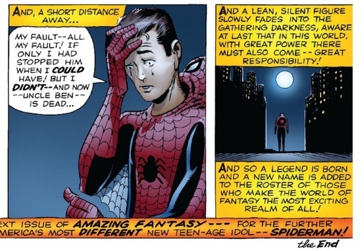

+++
date = "2018-03-20T17:36:00-04:00"
draft = false
visible = false
title = "Reading 08: Corporations And Nematoads Are People Too"
tags = [ "Ethics" ]
categories = [ "Ethics" ]
series = [ "Ethics" ]
+++

#What does it mean for a corporation to be named Jeff?

The question of whether corporations are people seems to be primarily about whether they have the same rights as other people.
The right to free speech seems especially important, as a few of the articles talk about corporate rights to political speech,
specifically whether corportations should be allowed to fund political things that I don't fully understand. Religious freedom seemed
pretty big too, especially with Hobby Lobby not wanting to pay for contraceptives. I thought Notre Dame was involved in some lawsuit
about that too, or something, but then we stopped that in like November of last year. 

If corporations are people, then they must have the same rights as people, at least in the United States. On the flip side, that would mean
that they should have to follow the same set of laws that people must follow. I think it would also require that corporations behave ethically,
as now they are not meerly automatons, but people, and so should have some degree of conscience. I've often heard "I'll believe corportations
are people when Texas executes one." - but that would be very bad. Wells Fargo has all of my money, all $73 of it. I think they've been
involved in some contest or something where they keep trying to end up in the news for doing bad things - their Wikipedia page lists
18 entries under "Controversies" for Wells Fargo. They keep getting fined for their actions, but what if they were just executed? Then
where would my money be? Huhhhh? Tying into our discussion of IoT devices, what if Phillips was executed? Then how would I get my 50 million
shades of white when their servers are taken away? Or more practically, what happens when a drug company is arrested, and their manufacturing
output decreases, so people die? It's kind of the whole point to corporations that they impact more people than individuals can, so when
you punish a corporation the way you punish a person, bad things happen. Personally, I think you can't really punish the corporation, you
have to punish the people leading it, but that defeats the purpose of a corporation, and then they're not really the people, but whatever.

#Why Sony should be publically executed:

So, I've decided my argument against killing off corporations doesn't apply to frivolous and foreign ones. Sony doesn't do anything
good for anyone. You know what Sony does? Sony leaks your PS3 credit card info, rootkits your PC, endorses EA's awful Star Wars Battlefron 2
DLC, and they even MADE [THE MOST LAZY, INSULTINGLY STUPID MOVIE OF ALL TIME](https://en.wikipedia.org/wiki/The_Emoji_Movie). So I say,
for all their misdeeds, I say they deserve to [pay the ultimate price](https://www.youtube.com/watch?v=CmKBbmuJPF8).

Anyways, I definitely believe Sony was both unethical and immoral. They put things on users' computers without consent or explanation,
did so irresponsibly, and in a way that could be exploited by more malicious actors, and perpetuated that stupid DRM nonsense - you bought
a set of music on a CD, you should be able to listen to that music for free for the rest of your life. CDs break. You should be able
to have as many copies as you need. Sony does not trust its users to act lawfully, so I say we should not trust Sony. And since they
like [lying to us](https://en.wikipedia.org/wiki/OtherOS) and [losing our data](https://en.wikipedia.org/wiki/2011_PlayStation_Network_outage),
it's probably smart not to trust them. I would rant about how they could have done this all responsibly, and told users, made sure they
understood, made sure it couldn't be misused, etc., but that's all moot. Their real sin here was DRM, and if they just didn't put any on
none of this would have happened.

How were they punished again? The one thing says they apologized. The EFF says they settled the case, but their link to details 404s for me.
I'm guessing Sony didn't learn their lesson though. They are [launching a new DRM platform](https://www.publishersweekly.com/pw/by-topic/international/london-book-fair/article/66098-sony-debuts-new-drm-for-publishers-digital-spotlight-2015.html)
that includes the goal that the user doesn't know it is there. I sure hope that means it doesn't get in the way of what the user wants
to do, because that's the kind of thing someone who put a secret rootkit on your computer without telling you would say. I can't find
any details on this particular DRM, but I consider any DRM to be a bit evil. I guess that's off topic. Anyways, I'm a little torn on
whether their "punishment" was enough. On the one hand, punishments are kind of meant to be deterents, and they haven't really done anything
as bad lately, though I guess cripling the PS3 was a mean thing to do, but is really more "false advertising" than "installing malware
on your computer." I guess something a little tighter would have been nice, like "No implementing DRM ever again", and then they
can still be executed for making The Emoji Movie.

#That Last Question:

Hmm... I answered it a little already, so I guess I'll answer it more so I don't lose points. I definitely think having rights brings
with it having moral and ethical obligations, but I think those requirements are irrelevant. The moral and ethical obligations a person
has seem to be a small subset of the obligations a corporation *should* have. If I am a single person, I have obligations to protect
myself and to not harm others. If I am a father of four, I am obligated to protect my whole family, and to ensure that my children
do not harm others. If I am a corporation, I *should* have to ensure that all of my members are acting morally, that I myself am acting
morally, and I must consider the results of my actions in far greater depth than any human being would need to, simply by the fact
that I, as a corporation, have a lot of power to really mess things up. It's like that one thing that <s>Professor Bui</s> Spiderman always
says.

So yes, corporations do have the same ethical responsibilies as people. They need to ensure that they do not negatively impact the world,
the same as the rest of us, but they need to be far more careful. And when they do mess up, they should expect some sort of punishment.
I'm still really unclear as to the best way to punish them, since crippling some companies can cost lives, or greatly harm the livelihoods
of those least responsible. (You fine a big company a billion dollars? It's the lowest ranking employees who are getting laid off. The CEO
is still getting his bonus.) So I guess the government needs to excercise even greater care in punishing the companies. Maybe just ban all
high level employees from any work for 6 years. That might work.
