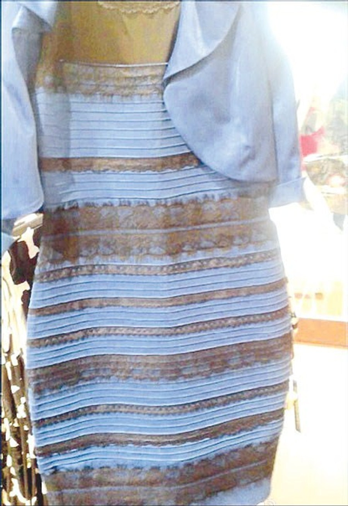

+++
date = "2018-04-02T17:36:00-04:00"
draft = false
visible = false
title = "Reading 10: !suggest cse-40175-sp18 all your base are belong to us, shoot that doesn't work, well, @jcioffi you're still legally required to read this, or does this count as cyberbullying or harassment or trolling, and you have to read that part also"
tags = [ "Ethics" ]
categories = [ "Ethics" ]
series = [ "Ethics" ]
+++

So, I went into this reading fully expecting to be like, "Trolling! Yeah!", but that first reading took a lot out of me. I feel like sending someone a message as their
dead father is just cyberbullying. Real trolling doesn't need to be so mean. That article defines trolling as harassing people, sending hate and abuse online.
In fact, pretty much all the articles on trolling seem to be about harassment. The wikipedia definition of trolling is seeding discord online. Harassing people is
not a good way to do that. The first article started off with a great way to do that - you comment on that picture about the gray optical illusion, and you wait
for someone to call you an idiot, and then a big fight to break out. Attacking one person is not trolling, it's just being an idiot. The best way to troll is to
post an obviously wrong opinion and then watching the fireworks. Here's an example:

This dress is white and gold, and if you think otherwise, you're wrong.

So you see, it may seem like trolling is about harassing people online, but it's actually about ethics in gaming journalism. Wait, that's a topic this week. Huh. Anyways,
trolling manifests itself as people trying to trigger other people on the internet. Obviously it can and does go way too far, and people abuse their anonomintintnity.
The intended effect of trolling /should/ be people getting into heated arguments and the troll him/herself laughing and eating popcorn. But more often than not, the
result is someone gets hurt because people on the internet are jerks. Like, I feel like it shouldn't need to be said, it's not OK to
[<s>smother your kids</s>](https://youtu.be/bh93LGfWi0Q) harass other people, even anonymously online.

Cyberbulling is how I would describe most of the incidents the trolling articles talked about. Cyberbulling is bullying people through digital devices, and is very
different from regular bullying. Unlike regular bullying, cyberbulling is very likely to occur outside of school, and it doesn't go away - there is no safe haven
from it. Additionally, when it is anonymous, it is easier to feel like more people are against you than who are with you - with traditional bullying you can see
that it's just one jerk and not the whole internet. Finally, many feel that you can just ignore cyberbullies, but those who say that probably haven't ever been
in a fight before. It's hard to just ignore something when the whole world can see it, or even when it's just in a private message to you. At least with regular bullies
you can punch them in the nose.

Anyways, I'm not quite sure what companies should do about people being jerks online. I'm really against censorship, but
[I clearly think something should be done about people being jerks online](https://github.com/AndrewLitteken/toxbot). I think reddit was right to ban r/fatpeoplehate,
and I can't believe r/watchpeopledie is still a thing. Companies like YikYak (rip in peace) had to do something about their cyberbulling problems, and I think they
were smart to just ban the high schools from using it. I guess my ideal solution is to have community moderators, where if you don't like the reddit mods, you make your
own subreddit or something.

Originally, I was like, "shoot, gamergate seems complex, after all, she was guilty, right?" but Wikipedia says "#gamergate hashtag users falsely accused Quinn of an unethical relationship with journalist Nathan Grayson", and why would Wikipedia lie to me? I guess I'll first write a bit about my prior assumption, that she was guilty. Even
then, she totally didn't deserve what happened. If you're doing something unethical and you get called out? Fine, you deserve it. But you don't deserve death threats
or repeated harassment. And apparently the whole thing was started by her ex and the accusations were all untrue. I actually didn't pay any attention to it when
this happened, because I hate gamer culture anyway, and just wanted to play Halo illegally on the library computers in peace. But I wish I had paid attention
so I could have trolled her harassers. Who doxes people? Seriously? (I also want to say CNN is fake news because they threatened to dox someone, and so they deserve
that insult.) We should not tolerate such things as this online. I'm not quite sure what the penalty should be for general harassment, but I at least figure if
you threaten someone or dox them, you should go to jail, that'll teach you.

Cyberbulling is a major problem, yeah. I already touched on how I feel about telling people to deal with it. Even regular bullying I don't consider OK, but now
we let it happen all the time. Personally, I think kids should have limited online interaction - maybe no facebook and twitter. I grew up with AOL's kid chatrooms, and
got muted for being proud of a website I made, and then when I was unmuted I said "I didn't link to a stupid website" and got banned. We don't need that kind of
stupid moderation, but we certainly can't have kids writing stall notes about each other online either. I don't know if it's on the websites they use, though.
They're not typically made for kids. If you advertise yourself as kid friendly, then sure, you have to stop cyberbullying. But otherwise, I do think parents have to
be careful about what their kids do. Set up a whitelist on your router. Block RuneScape after 10pm. Whatever.

I think the first article on cyberbullying sucks. It's all about the consequences but has nothing to do with the causes. "I hope they (children) realise they cannot blatantly harass anybody and not get caught." - this is not good. You shouldn't expect or even want kids to realize they shouldn't do something because they'll get caught.
They should not do that because harassing people is not a good thing to do. One article talks about showing a "that looks harsh! are you sure?" message before sending.
YikYak did that. It sucked, because any time I posted things like "shoot" (instead of "dang") it would warn me. I typed in a course number once, and it warned me that
it looked like I was doxing someone by sending a phone number. Really? For those to work at all, the machine needs to be smart. I don't think having facebook moderate
things is feasible at all, but I do think maybe an AI that flags messages posted by children or on children pages might be nice. Of course, I think parents should
make full use of parental controls and all that, but facebook could make it easier, by maybe adding things like "no chat messages, or, all you send are forwarded to me",
and the like. Speaking of which, I think my 15-year-old AOL account still has parental controls on it.

Trolling is definitely a problem, but I don't want it fixed. I love messing with people. I would say most of what I say online is meant to either confuse someone
or make them mad at me. I never harass people, and I would say I haven't even been mean to someone online since I was like twelve, but I guess I'm not the kind of
troll that's a problem. Well, maybe I am. It's hard to tell what is serious online now, and because a lot of people depend on the internet being correct, that's
a bit of an issue. But worse are the people who are just trying to make people hate eachother, you know, the real trolls. I can't stand to see someone mocking
someone because they bought one product over another, or voted for one candidate over another, or were born in one country instead of another. Seriously? Grow up.

I hate real name policies. They work a little, but I'll still see trolls in articles with facebook comments. My rector told us all to uninstall YikYak. They
added usernames. That was dumb. I mostly used it to spoof my location to troll Temple fans. That was fun. I also fixed some girl's gamecube one halloween. Anyways,
I guess I still would have trolled the Temple fans even if it was my real name, even after I publically apologized on facebook for my fellow Notre Dame students'
mean words - I think it would have been funnier that way if they had also seen me messing with them too. I disagree with the article saying being anonymous isn't
the issue, because I think it definitely contributes to a lot of the mean comments online. I'd believe that many harassers don't care about being anonymous, but
that's not all trolls, and they didn't even say it was most harassers. I guess it is also correct in saying that anonymosidfity can product people, too, as the
Google+ article highlights as well. Personally, I view real name policies as a threat to the idea that the internet allows you to take on a new persona, which I think
is very important at times. There are some news sites where I might want to take on a fake persona where I wouldn't be able to if I were forced to use my real name.
I don't want potential employers to see me pretending to be a wizard on CNN articles, that's just weird.

