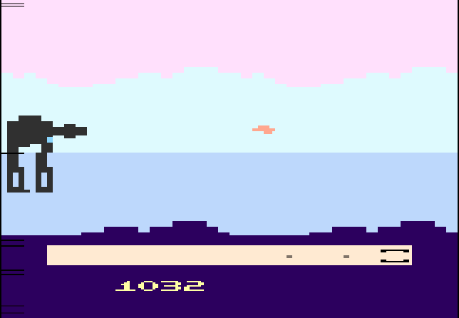
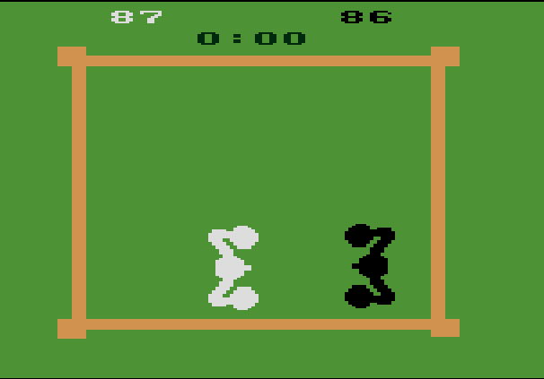
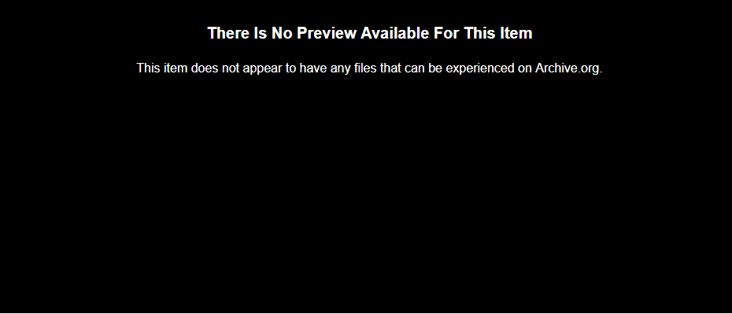

+++
date = "2018-02-02T17:24:00-04:00"
draft = false
visible = false
title = "Reading 02: I didn't think I had to do this one"
tags = [ "HoC" ]
categories = [ "Hoc" ]
series = [ "Hoc" ]
+++

I played a few games for the Atari 2600, because I grew up playing it (and last year for hackers
built an adapter for its controllers, which I did a [write up on](https://johnwesthoff.com/projects/atariusb/)). I guess I'll play a few games and give my opinions on them.

Bird Verse Camel  
--

I didn't actually play this one as a kid,
but I've seen [a review for it](https://www.youtube.com/embed/TcmkO8xoJW4?start=319&end=366&version=3) before.
The game is a rendition of the most forgetable part of the most memorable Star Wars movie. You fly around and shoot at the
bodies of AT-ATs, shooting the legs does nothing. I guess whoever made this game never played a MechWarriors game, which makes sense seeing as the board game was released 2 years later, and the
first video game 7 years later (in those games shooting the legs of mechs works well). You can land your ship to repair it. Every few seconds the AT-AT will have a weak spot appear, which will blow
it up in one hit if you shoot it. I mean, they say the Death Star flaw was bad, but I don't see how you can shoot a torpedo down a long shaft in space when any bit of acceleration would
cause the torpedo to hit the sides. I don't think we can blame the engineer for not accounting for Space Wizards (Rogue One handled this horribly, so I'm going to choose to ignore it), but having
random weak spots is just a serious design flaw. Your ship will also occasionally go Super Saiyan, at least that's what I think is happening. The Star Wars score will start playing, and your ship flashes,
and I think you are invincible during it, and your ship is fully repaired when it stops. I don't know what triggers it, and I don't think it makes any sense.

Anyways, the game seems to be an early example of a few tropes with video games that is still happening today:  

 1. *Head shots do more damage*. In lots of shooter games, shooting for the head became all the rage. There are games where a gun can kill in one shot to the head or three to the body. This took that to the
extreme. One shot to the weak spot kills the AT-AT, but you need FORTY EIGHT shots to the body to destroy it!  
 2. *People love survival games*. A huge portion of the love for Call of Duty is this survival game mode where you fight Nazi Zombies. People really like the idea of playing a game until they lose. Personally,
I hate these things in single player games. They work fine if you have a few friends with you, but with one person, I'd much rather be told an interesting story, and I'd much rather win than play for
eight hours just to lose.  
 3. *Games based off movies are bad*. I don't understand people who buy games based off movies, they're never any good since they're just cash grabs. Bird Verse Camel isn't a terrible game, but it's not
as memorable as a lot of the other Atari games. It does have one distinguishing feature, though - you shoot at a constant rate, rather than firing again as soon as your bullet disappears, which
was really common.  

Boxing  
--

  

OK, I did grow up with this one. My dad taught me the trick to winning is to get your opponent
towards the middle, and back closer to the ropes. Then you can bounce them between your fists
until you win. You win when you either get 100 points or 2 minutes passes and you have the lead.
In my experience, more matches ended from the two minutes than the point limit, since the game
doesn't have much to it. You get 2 points for close punches, 1 for long punches, so most of the
games I've played involve two people smooshed up against each other trying to get the juggle
started. Like most sports games, this one is fun to play with friends, but unlike games
like FIFA 14, there isn't much replay value. It's certainly not Combat.

Combat
--

  

Wait. I can't find that one on here. Seriously? I mean, you really need two players for it. It had
several modes, all focused around you shooting the other guy. It had modes where your bullets
bounced as tanks, modes where you were invisible, modes where you were planes... I could play
it for hours, it very much checks off the boxes for what I consider a good multiplayer game. It
had the oddities of the time - limited background colors, blocky graphics, and one bullet per
player at a time (so shooting the walls made you shoot faster), but it's the kind of game that
would still do well today.

Finishing off the reading  
--

I definitely think a lot of the memory of these games is from both nostalgia and the gameplay
elements that were popularized by these older games that can still be seen today. I don't think the
power of nostalgia can be underestimated. Recently I've been playing a lot of games done in the
style of early '90s games, and I find that most of my enjoyment comes from the type of music
and the graphics from the time. I don't think there is anything particularly special about most
older games, so I would say there is probably a 66/34 spit on nostalgia/importance for why
we remember these games.
