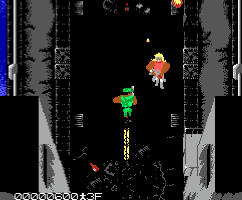
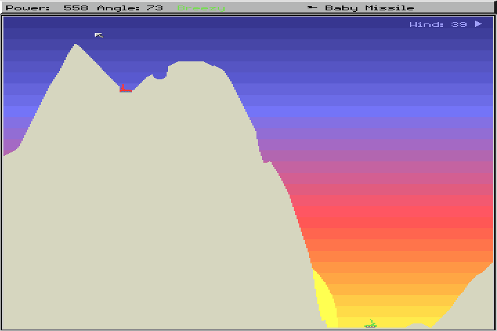
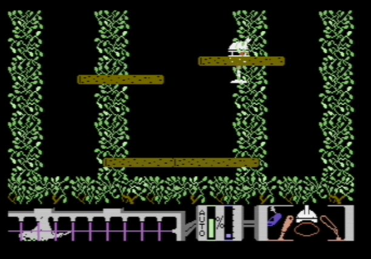

+++
date = "2018-02-09T17:24:00-04:00"
draft = false
visible = false
title = "Reading 03: I don't think I should have to do this one"
tags = [ "HoC" ]
categories = [ "Hoc" ]
series = [ "Hoc" ]
+++

NY Warriors
==

Since I'll probably be moving to NYC, I decided to start
by playing my dad's all time favorite game, New York Warriors, but the DOS version.
You can walk around with the arrow keys and shoot with space. It asks about sound drivers, as
well as setting up the controls. You walk around NYC and shoot gangsters, who also shoot at you.
It's pretty hard, especially because if you take too long a bunch of people on jetpacks drop
grenades on you (unless that's only on the Amiga version). I couldn't get past the second
level on the DOS version. 

The Amiga version is way better than the DOS version. For one, the Amiga version has much
better sound affects and much better background music. The DOS version has no sound affects, just
an annoying worse-than-chiptunes cycle of the same 7 notes made from about 3 differnt tones...
It drove me crazy, so I decided to play the Amiga version instead, which I set up the emulator for
already, I just had to download it from Dropbox. But I hate Dropbox now. They betrayed my trust
by making a giant ad for themselves called The Emoji Movie. In the Amiga version you can shoot
diagonally, which makes it easier. The emulator won't load levels if the keyboard is set up as
joystick port 1 for some reason, so I had to keep switching the mouse and keyboard to play, since
it would load levels if the mouse was the first joystick. Whatever.

I will say that setting up the DOS version is a bit easier than the amiga version. Actually,
a lot easier. There are too many things I can do to the amiga version. None of the settings are
in game. I remember it being a real pain to launch the game from the console, but I've
forgotten what that is like, since I saved the RAM of the amiga and have a script that loads it
when you launch `NYW.bat`. Even the DOS version asked for an audio driver though, and a few played
no sound, one said the hardware wasn't installed, and the other played the annoying sounds.
Consoles quickly didn't have this problem. The Atari you had sliders for color/monochrome,
and mode/difficulty, which most games replaced on later systems with menus. The NES had nothing
to really configure, things just worked after you blew on the cartridges.

Scorched Earth
==

Breezy and I play the game Pocket Tanks together online all the time. Pocket Tanks, written by
Michael P. Welch, evolved from his earlier Amiga game Sorched Tanks, which was inspired by
Scorched Earth. So, I guess I'll see what inspired the game that was turned into a PC clone that
was ported to Android after like 17 years.

It played like I expected, you set power and angle and then shoot stuff at each other, and the 
terrain forms holes that then fill down. 
Except I couldn't figure out how to change weapons and had to google
it. That is a problem that PC games have, there are more potential controls, and the games
could be more complex, so you can be more lost in the game. I think the next game will illustrate
that more.

Spiderbot
==
I couldn't get the Apple II or DOS versions working on the internet archive, so I downloaded
a commodore 64 emulator. The commodore 64 showed READY and then anything I did made it say
`?SYNTAX ERROR`. So once again I had to look things up. I had already inserted the disk image,
so then I had to `LOAD "$",8`, then `LIST`, then `LOAD "SPIDERBOT",8,1`, and finally `RUN`.
Some of that made sense. A lot of it didn't. Then I was shown an intro video by the guy who
cracked the game. Great.

Then I was a small robot and I could walk around. Pressing the joystick button shot out a net.
I caught a poor defenseless animal. Am I a creation of Dr. Robotnik? Anyways, the controls
in this game don't make sense. To jump, you press down and then up. But you can jump through
platforms. But not always. It seems really arbitrary when you're allowed to jump - there
are some vines that I can climb some times but the same vines I can't climb later. You can
release the animals you caught by holding down and then pressing the shoot button, and then
selecting the animal to release, but I don't know what that does for me. I ended up getting
stuck in a room until the time ran out and I died. Oh well.

That's the room that I spent my life in. I can't climb the vines above about where the robot's head
is now. I'd google how to get past it, but I've already seen a 
[really good review of this game](https://www.youtube.com/watch?v=XZSObFVfI5E).

Which is better?
==

I forgot to compare the types of games that are good on each. Back then, it seemed that
platformers and simpler games worked better on console, and more complex games worked better
on PC. I think there was a brief time in the 2000s where there was a difference, but that has
passed.
Now, categorically I think all games are better on PC now compared to home 
consoles. Games played on a big screen? I have a projector for that. I used to 
have my computer hooked up to a TV. I can play my first person shooters real 
good on the PC. I can play Mario Kart 8 on a higher resolution than on my Wii U 
or my Switch, with whatever controllers I want, at full speed. PC gaming has 
the one disadvantage of a much higher upfront cost, a full HD good experience 
will cost around $600, compared to say $300 for the Switch or Xbox One. But 
then the games are much cheaper on PC. I refuse to pay more than $20 for a PC 
game, and usually pay less than $5. I have over 300 PC games, not counting all 
of the free games that I can play, and they will keep working on newer hardware 
for the foreseeable future. My PS3 couldn't play PS2 games, and my PS4 can't 
play PS3 games... Really? I can still play Half-Life. If I load VMs, wine, or 
emulators, I can play games that are even older.  I remember playing Halo 3 split screen.
They don't do that anymore. If I want to play games with my friends sitting on my futon, we play
PC games. I do think consoles will stick around, but the PC wins out on versatility by
a landslide. #PCMR
