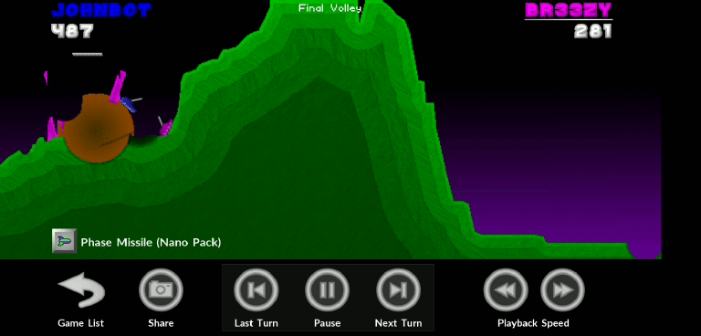
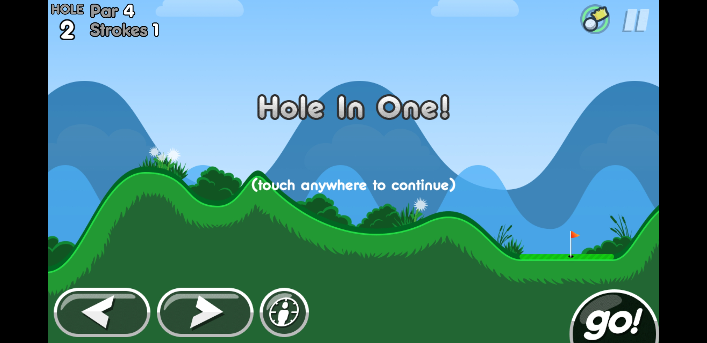
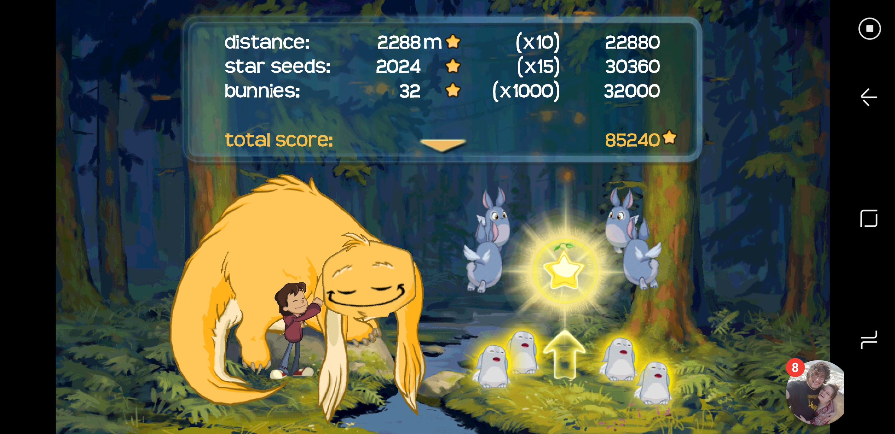

+++
date = "2018-04-05T17:24:00-04:00"
draft = false
visible = false
title = "Reading 08: @channel haha yes"
tags = [ "HoC" ]
categories = [ "Hoc" ]
series = [ "Hoc" ]
+++

Pocket Tanks
===

I'm totally cheating, since I mentioned this game before and reviewed the game it is indirectly based off of, but still, I play this all the time with Breezy.
Just watch:

Pocket Tanks is a game that fits very well as a social game, but they chose not to. You can connect it to facebook, but that just lets you log in, you can't
post challenges to social media or anything like that. But it's a two player artillery game
that is ripe for that sort or thing, it could easily be just like Words with Friends or other
trash games.

That said, it does have paid DLC. There are 12 paid DLC weapon packs that each add 15 weapons
to the game, in addition to the 30 weapons from the free version and the 30 for the $5 paid
version of the app that gives access to the paid DLC. And this DLC is pay to win, too, since
some of the weapons are just objectively better than the free ones, well, actually, the two
I consider the best are both free. But the weapon selection is random, and a lot of good
weapons are paid DLC.

I'm actually OK with this though. This game is 17 years old. There was no online play
for most of its life. The game was meant to be local multiplayer. When you do local multiplayer,
there is no pay to win. Also, it's only $17 to buy everything, $20 on PC. That's way better
than consumeable DLC. Plus they add content. I might be going easy on it because it's a game
I've literally played my whole life, but I think their DLC model is fine. I hate EA and their
garbage microtransactions though. The free version doesn't have enough firepower to compete, though, and after the game
ends it shows you a random weapon they used and what pack it was from to encourage you to buy it, even if you already own them all like me.
Not entirely sure how I feel about that, but still, it's $20 for it all forever, no recurring subscription (which I'm also ok with, as long as it's
constant and the content is good, i.e. RuneScape and the like), or "pay us $1 to do better for one match", which is pure garbage.

I don't see mobile gaming as positive or negative, it just is. It's like asking what I think about TV shows now that YouTube is a thing. They don't replace each other,
at least not in a meaningful way. I could probably live with only playing mobile games, and I could probably live with only watching YouTube. But that's not
why I played PC/Console games or watched TV to begin with. The type of content is just different, he says after reviewing a mobile game version of an old PC game.

BTW Pocket Tanks is a "choose weapon, set power, set angle, fire" kind of game, with like 320 different weapons. It's pretty fun, in my top 2 artillery style games,
with only Arcanists, a real time but still turn based oneone like Worms, potentially beating it out, but that game is even more pay to win and is dead now. RIP.

Super Stickman Golf 2
===

Speaking of microtransactions... 

I actually like SSG2. It's a fun diversion. The courses aren't that creative, and the game has a difficulty ramp like crazy, but it's a fun little game. I stopped
playing it when I switched phones, but... hey, wait, I remember this game giving me the option to earn in game currency with money, and watching videos and the
like... where did that go? Anyways, it has a lottery for earning in game boosts using in game currency, as well as purchaseable items and levels. It seems
built around pay for stuff, but it seems to not have that anymore. I'm confused. Anyways, I hate free games where you can earn things in game, or pay to get
it faster. Pay to not play is the worst microtransaction type. It's especially common in city builders and other games with artificial in game timers that you can
pay to shorten. Those are the worst. You should never be able to pay to play the game less. Why did RuneScape add buyable currency? It used to be in their rulebook
that real world status should not affect in game status. RIP.

SSG2 is a golf game, by the way. You're a stick man and you set an angle and power, and you take shots. There are special powerups and hats that change things. It's
fun and casual. Wait, what's with me and setting power and angle?

Buddy and Me
==

I'll end on a high note, with a game I associate with racism.

It's a simple, family friendly, super charming infinite runner called Buddy and Me. You play as a young child who is dreaming, and you collect stars and bunnies with
your imaginary friend, Buddy, a fluffy dragon creature. You can jump three times, gliding on the third. The platforming isn't great, but there is so much
charm in the sounds and visuals in the game that it's still very worth it. There is no DLC or anything like that, just a nice little diversion for a few minutes, or for
me to spend all of finals week spring freshman year playing until 4 AM while also binging The Boondocks, I mean me too thanks.

For this review I actually got my all time high score, which is 44th in the world (RIP), but first of the 9 times people played it this week (double RIP).

I don't think mobile gaming has really any bearing on the more traditional gaming, it's just a new market. Like board games and video games. It's a different market,
with some overlap, but I'm not going to replace my PC gaming with mobile gaming.

Wait, RuneScape mobile is coming out. Nvm.
