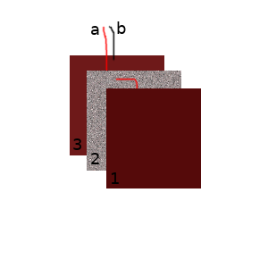

+++
date = "2017-01-03T06:24:00-05:00"
draft = false
title = "Live Action Armor"
heading = "Ideas"
+++
For a while now, I've been wanting to create a set of foam armor that can keep
track of hits and their locations. As a kid I used to like fighting with foam
swords, but there wasn't an easy way to stop people from lying about being
hit. It would have been nice to have something like what I describe below:

The basic idea for hit detection I came up with is shown in the image below.
Basically, there is a panel of conductive foam between two metal sheets.
Wires are attached to each metal sheet, and the sheets are connected to the
foam with conductive glue. Conductive foam has the property that when it is
compressed its depth-wise resistance decreases. Thus, when the sandwich
is struck, the change in resistance should be measureable across the two wires.

By using these wires in a voltage divider, an analog to digital converter
connected to a microcontroller should be able to detect when the sheets are
struck, and to some degree how hard. I would like to make at least two of
these sandwiches, and make a simple wearable sandwich board out of them.
The wires from both sandwiches would feed to a single controller
down by the hips. Additionally, it would be cool to have an addressable RGB
strip located by the shoulder to display "health" as a bar.

The armor suit should also have 4 pin molex connectors - two on the bottom edge,
and one on each side edge. The purpose of these connectors is to allow
the user to attach arm pads and leg pads. Two of the pins would be for power,
and the remaining two would be for I2C communication. On startup, the
central controller would search for attached I2C devices, and poll them.

Arm and leg pads would have two DIP switches, for selecting position
(upper or lower and left or right). They would have a molex connector that
connects to the central controller as well as another connector for
daisy chainging pieces. This allows for a user to have an armor piece on their
upper arm and forearm, if desired.

I am considering using an MSP430
microcontroller for the peripheral armor pieces, as I have experience with them,
and they contain an internal ADC as well as the capability to be an I2C device.
For the central controller, I am planning on using an ESP8266, because
they are cheap and have both an ADC and I2C capability. The ESP8266 also
has the added benefit of being WiFi enabled, so it would be possible
to have a central base station that each user connects to
for something like a central high score table.

