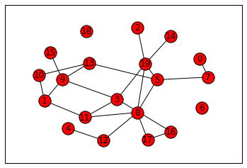

+++
date = "2016-04-25T16:35:53-04:00"
draft = false
title = "NetworkX Test"

+++
Once again, I was playing around with [Jupyter](http://jupyter.org/). This time I was more interested in seeing how it handled 
[NetworkX](https://networkx.github.io/). It seemed to work fairly well, though
the kernel died using above 500 connected nodes.
<!--more-->

Networks
========


```python
import networkx as nx
g = nx.nx.erdos_renyi_graph(5,1)
```


```python
import matplotlib.pyplot as plt
%matplotlib inline

fig, ax = plt.subplots()
ax.grid(False)
ax.xaxis.set_visible(False)
ax.yaxis.set_visible(False)

nx.draw_networkx(g,ax=ax)

plt.show()
```


