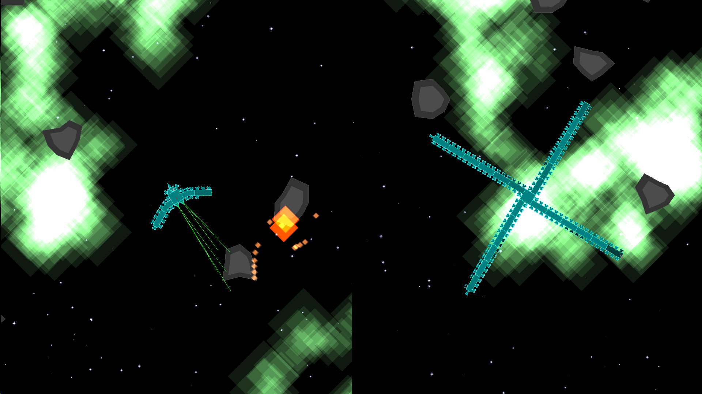

+++
date = "2016-07-17T23:24:00-04:00"
draft = false
title = "Multiplayer Spaceship Game"
tags = [ "Projects", "Java", "OpenGL", "Graphs" ]
categories = [ "For Fun" ]
series = [ "Game Development" ]
+++
Back between 2008 and 2011, I spent a fair bit of time on 
[FunOrb](www.funorb.com). 
One of their most interesting games was their last official release, 
[Void Hunters](http://www.funorb.com/info.ws?game=voidhunters). 
Unfortunately, FunOrb did not last much longer than that, as there has only been
a small handful of updates since then, and with the death of NPAPI Plugins, the
Java-based gaming site has virtually no chance of being revived.

Some time around my freshman year at Notre Dame, I decided that it would be fun
to recreate the game. As a huge fan of split screen gaming, my version would not
be online, but rather it would be played with a shared split screen and several
XBOX 360 controllers.

Anything Interesting About It?
----------
Maybe.  
The game itself essentially broke everything into two groups - 
Entities (such as bullets, stars, asteroids, and nebula)
and Components (things that make up ships, like hull pieces
and thrusters). The Components are the more interesting of the two, as they 
collectively form a symmetric directed graph. There are container pieces,
such as hulls, that can have other components attached to them as well
as be attached to other pieces, and other components that can only be attached.
Container pieces each contain references to their attached pieces, and
all pieces contain references to their holders. This makes it easy
for any one component to affect its holder (for instance, a thruster
adds impulse to its holder) and for any holder to affect its components (for
example, a blown up hull might destroy all of its components).

The game looks pretty, if I do say so myself.

Any Problems?
----------
Yes.  
Using Java might have been a mistake, as I might have gotten better performance
out of C or C++. The game has pretty big performance issues, especially with
rather large ships colliding, and this is with just two people.
I also should have learned a bit more about graph theory before
starting, as I hadn't even had an introduction to it before, and perhaps I would 
have written things a bit more efficiently had I done it today with more knowledge.
Learning more OpenGL would have also been a big plus, since it was my first time
using the library. I also wish I had documented things more thoroughly.
I may restart the project, if I have the time.

[The source is available on my GitHub.](https://github.com/JohnathonNow/VH-Remake)