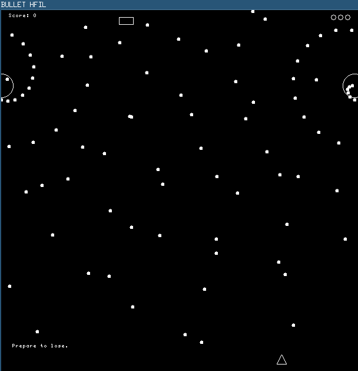

+++
date = "2016-03-20T21:08:52-04:00"
draft = false
title = "Fundamentals of Computing I Final"
tags = [ "Projects", "Notre Dame", "Bullet HFIL" ]
categories = [ "Computing" ]
series = [ "School" ]
+++

For my **Fundamentals of Computing I** class final project,
I decided to make a [shmup](https://en.wikipedia.org/wiki/Shoot_%27em_up#Types).  
The game is played at a faster pace perhaps than it should have been,
but I enjoyed making it.  
The graphics are very minimalistic, consisting almost entirely of circles.  
The game features a half-decent level intrepretation system, where
levels are stored in text files with simple commands to handle enemies
and other things. The system had support for branching and conditionals,
though the only condition allowed was time. I had to exercise restraint
to prevent myself from essentially making it a complete language of
its own.

The game itself is _really_ hard. Below is a screenshot from the third level:  

The source is available on my [github](https://github.com/JohnathonNow/fndcmpifinal).

