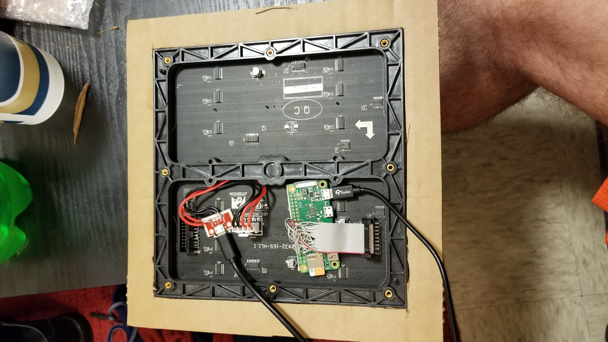
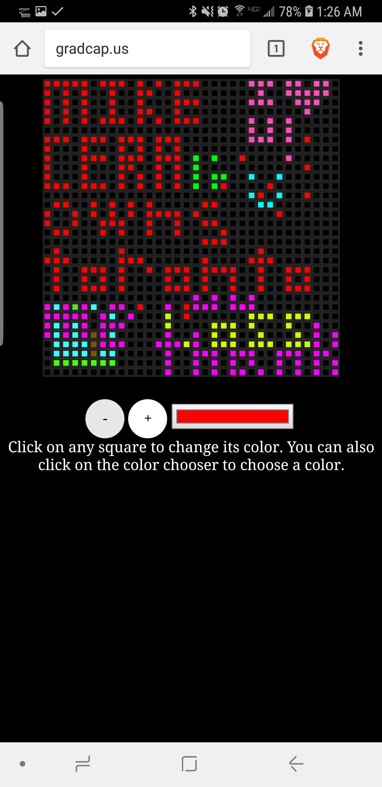
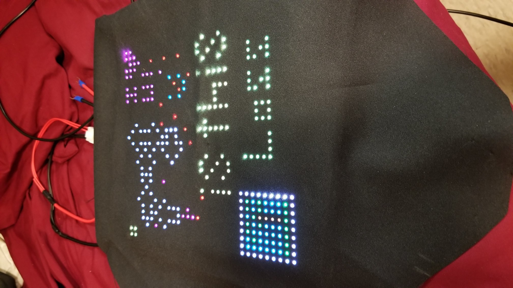
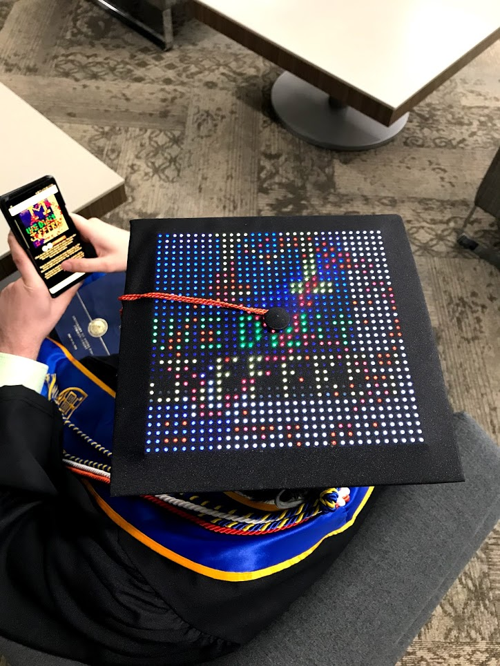

+++
date = "2018-05-26T12:03:30-04:00"
draft = false
title = "Internet of Graduation Caps"
tags = [ "Projects" ]
categories = [ "Summary" ]
series = [ "School" ]
+++

During my last summer internship, a thought popped into my head. I realized that it wouldn't be too hard to stick an LED matrix under
my graduation cap, to have one that would be totally unique. Well, [it turns out someone beat me to the punch](https://imgur.com/gallery/xr0P0), but I could still make one that was totally unique by stealing ideas from other places too. 
Reddit's [r/place](https://www.reddit.com/r/place/) was really cool. I figured I could recreate that on a 32x32 board.

My original idea was to just order an LED matrix, stick hook it up to an ESP8266, and broadcast a Wi-Fi hotspot. Then, if anyone connected
to the hotspot, they would be redirected to a page where they could place pixels on my graduation cap. I ultimately decided against
broadcasting my own hotspot and redirecting people, because that seemed more prone to not working well.

I instead bought a [Raspberry Pi Zero W](https://www.sparkfun.com/products/14277) and had it connect to a mobile hotspot broadcast from
my phone. It was hooked up to an [LED Matrix](https://www.sparkfun.com/products/14646), and both were powered from a
[USB battery pack](https://www.amazon.com/gp/product/B078LSPGP1/ref=oh_aui_detailpage_o07_s00?ie=UTF8&psc=1). 

I disassembled my graduation cap, and cut out a square in the cardboard mortar board to put the LED Matrix into,
to try to keep the cap flatter. Next, I wired the Pi Zero W to the LED Matrix, and I wired the LED Matrix to a Micro USB breakout board
in order to power it. The bottom ended up looking like this:

Once it was all wired up, I set up [hzeller's LED Matrix library](https://github.com/hzeller/rpi-rgb-led-matrix) on the Pi, and ran one
of the demos. The ribon cable that came with the matrix didn't solder well, so it had some bad connections, so I ended up de-soldering it
and soldering on individual jumper wires, but once that was done, I was met with this:



I was really happy. On the software side, I wrote a little web app in python and cherrypy. It has a little javascript front end and sends
clicks to the server. The clients, both for the pi and for the website, use long polling to receive changes to the grid. I won't share
the URL, because I don't plan on keeping it, but I also won't crop the URL out of the screenshot below. Plus, the URL is hardcoded into
the [code on GitHub](https://github.com/JohnathonNow/jeffrey-gradcap), so I can't really stop anyone from finding the site. Just know that
I do not endorse anyone visiting it, as odds are I will not control the domain in the future. Anyways, here's that screenshot I mentioned:

That screenshot is a little outdated, and it might have packed more punch to show what that screenshot looks like on the cap, but
chronologically, next I put the fabric over the LED Matrix, making it look like this:

Next I had to add the tassel, and I also wanted some more fun things on the cap. I noticed the library came with a game of life demo, which
saved me from coding my own. I did alter their code slightly, and kept track of how long each cell was alive, and then showed each cell
in a different color based off how old it was. It went something like this:



After that, I hot glued the cap back together and shared the link to the r/place clone that controlled my cap with my friends and classmates.
I had some sense to not let them touch it during the main commencement ceremony, as that was big and formal. Instead, during commencement
the hat displayed a static ND logo. But once I left the stadium I switched the hat to show live updates of the r/place clone. Shortly before
my diploma ceremony, it looked like this:

Not sure how I feel about the big Michigan logo, but it was promptly replaced with an ND logo, so that was good. The hat survived all day,
with the battery lasting with 3 out of 4 bars left. The hat survived the rain, which really worried me. I consider this project a success,
but don't really know what to do with the cap. For now I guess it'll stay intact.
